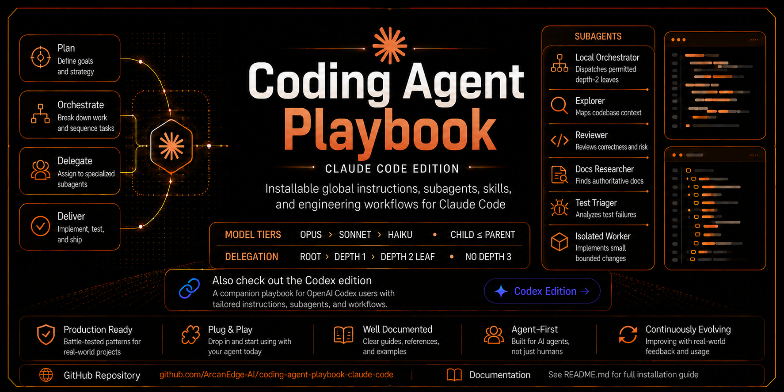

<p align="center">
  
</p>

<h1 align="center">Coding Agent Playbook — Claude Code Edition</h1>

<p align="center">
  <strong>Installable, managed global instructions, subagents, skills, and engineering workflows for Claude Code.</strong>
</p>

<p align="center">
  Configure Claude Code to behave less like a loose autocomplete engine and more like a disciplined senior engineer: orchestrate bounded subagent execution, plan clearly, coordinate parallel work, verify honestly, and ship maintainable code.
</p>

<p align="center">
  <a href="#install-with-one-prompt">Install</a> ·
  <a href="#quick-start">Quick Start</a> ·
  <a href="#harness-editions">Harness Editions</a> ·
  <a href="#why-this-exists">Why This Exists</a> ·
  <a href="#whats-inside">What's Inside</a> ·
  <a href="#subagent-model">Subagent Model</a> ·
  <a href="#formal-task-graph-orchestration">Task Graphs</a> ·
  <a href="#task-local-worktree-lifecycle">Worktrees</a> ·
  <a href="#coordinating-parallel-claude-code-sessions">Parallel Sessions</a> ·
  <a href="#repository-structure">Structure</a>
</p>

<p align="center">
  
  
  
  
  <a href="https://github.com/ArcanEdge-AI/coding-agent-playbook-codex"></a>
  
  
</p>

<p align="center">
  <strong>Using Codex instead?</strong>
  <a href="https://github.com/ArcanEdge-AI/coding-agent-playbook-codex">Open the Codex edition</a>.
</p>

---

## Install with One Prompt

The easiest install path is to give this repository URL to your coding agent:

```text
Install this globally: https://github.com/ArcanEdge-AI/coding-agent-playbook-claude-code

Follow the repository's INSTALL.md exactly. Use full mode even when an older installation exists; do not infer support-only mode unless I explicitly request it. Preserve my existing instructions, back up anything you change, install the global instructions, references, skills, and custom subagents, then report the installed files and validation results.
```

That is the intended public experience: users should not need to understand the file layout before installation. The agent should read `INSTALL.md`, clone or fetch the repository, install into user-level Claude Code configuration locations under the resolved Claude Code home, validate the result, and report what changed.

Support-only is an explicit pointer-only configuration, not an update mode. Use it only when the user confirms the global instructions already live in their global `CLAUDE.md` manually:

```text
Install this in support-only mode: https://github.com/ArcanEdge-AI/coding-agent-playbook-claude-code

I already added the global custom instructions manually. Follow INSTALL.md, but do not duplicate the full instructions into CLAUDE.md. Install references, skills, and custom subagents only.
```

---

## Quick Start

### Agent install

Ask your coding agent to install the repository URL and follow `INSTALL.md`. Normal installs and updates use full mode.

### Manual install: macOS / Linux / WSL

```bash
git clone https://github.com/ArcanEdge-AI/coding-agent-playbook-claude-code.git
cd coding-agent-playbook-claude-code
bash install/install.sh --full
```

Support-only mode:

```bash
bash install/install.sh --support-only
```

Dry run:

```bash
bash install/install.sh --full --dry-run
```

### Manual install: Windows PowerShell

```powershell
git clone https://github.com/ArcanEdge-AI/coding-agent-playbook-claude-code.git
cd coding-agent-playbook-claude-code
pwsh -ExecutionPolicy Bypass -File install/install.ps1 -Full
```

Support-only mode:

```powershell
pwsh -ExecutionPolicy Bypass -File install/install.ps1 -SupportOnly
```

Dry run:

```powershell
pwsh -ExecutionPolicy Bypass -File install/install.ps1 -Full -DryRun
```

### Repository-specific guidance

Copy this template into individual projects as a starting point:

```text
references/templates/repository-CLAUDE.md
```

Save it as `CLAUDE.md` at the project root, then fill in the actual build commands, test commands, architecture rules, generated-file rules, and release expectations for that repository.

---

## Harness Editions

Coding Agent Playbook ships as separate harness-native editions. This repository is the Claude Code edition.

| Edition | Repository | Use when |
| --- | --- | --- |
| Claude Code | `ArcanEdge-AI/coding-agent-playbook-claude-code` | You want global Claude Code instructions, reference docs, skills, and subagent definitions. |
| Codex | [`ArcanEdge-AI/coding-agent-playbook-codex`](https://github.com/ArcanEdge-AI/coding-agent-playbook-codex) | You want the harness-native edition tuned for Codex. |

The philosophy is shared across both: the root agent acts as the senior engineer and orchestrator, subagents perform bounded evidence-backed execution, independent project sessions are coordinated explicitly, and final decisions stay with the root agent.

---

## Why This Exists

AI coding agents are powerful, but they often fail in predictable ways:

- They start coding before understanding the codebase.
- They over-engineer simple requests.
- They refactor unrelated code.
- They trust editor diagnostics over real builds.
- They claim tests passed when they did not run them.
- They delegate poorly or blindly accept subagent output.
- They allow parallel sessions to develop incompatible contracts or ownership.
- They turn every task into a context dump instead of a focused engineering loop.

This playbook gives Claude Code a durable operating model:

```text
Understand → Plan → Implement → Verify → Review → Report
```

The intent is not to make the agent slower for its own sake. The intent is to make it **less wrong**, especially on real repositories with existing conventions, local changes, and concurrent work.

---

## What's Inside

| Area | Path | Purpose |
| --- | --- | --- |
| Install guide | `INSTALL.md` | Agent-readable install contract for one-prompt installation. |
| Install scripts | `install/` | Manual installers for Unix-like shells and PowerShell. |
| Global instructions | `custom-instructions/` | Tool-agnostic behavior rules for elegant, maintainable code. Paste into your global `CLAUDE.md`. |
| Prompts | `claude-prompts/` | Setup and active-project coordination prompts. |
| Reference docs | `references/` | Claude model and capability routing; finite subagent delegation; task-local worktrees; multi-session coordination; and reusable templates. |
| Skills | `skills/` | Reusable workflows for task-graph, subagent, and worktree orchestration, session coordination, document routing, and senior review. |
| Custom agents | `agents/` | Claude Code definitions for a bounded local orchestrator, direct workers, and non-spawning execution leaves. |
| Repository guidance | `CLAUDE.md` | Instructions for maintaining this public playbook repository. |

---

## Install Modes

### Full install

Use this for normal installs and updates. Full mode is the default and safely replaces the playbook-owned marked section and current managed files.

Full install writes the global instructions into the user's global `CLAUDE.md`, installs references, skills, and custom subagents, and records their paths and hashes in a managed-file manifest. Later updates can back up and retire unchanged files removed upstream while preserving customized or unrelated files.

### Support-only install

Use this only when the user explicitly says the global instructions already live in their global `CLAUDE.md`.

Support-only mode avoids duplicating the full instruction file and installs only the supporting reference docs, skills, and custom subagents.

---

## Core Philosophy

The root Claude Code session is the senior engineer and orchestrator.

It owns:

- task understanding
- the working plan
- architecture and design judgment
- root topology, routing, permits, and budgets
- parallel-session coordination
- integration and final acceptance
- final diff
- validation strategy
- final response

For repository tasks, subagents perform bounded execution when they are available; the root still owns the outcome. Independent Claude Code sessions may own separate workstreams, but the coordinating root owns compatibility and integration decisions.

> Delegate at least one bounded execution assignment when subagents are available. Root direct execution is limited to unavailable subagents, an explicit user prohibition, or a specific authority-bound action that cannot be delegated; record the exact exception.

For multi-node work, the root records the actual user-selected root model, a finite manifest, total subagent budget, child-specific permits, real dependencies, ownership, model and capability ceilings, exact workspaces, and verification gates. Dispatch only ready permitted nodes with remaining budget and runtime capacity. Small tasks may skip formal graph mode and use one direct worker.

Subagents share the current workspace by default. The auxiliary-worktree budget is separate and starts at zero. Only the root may authorize worktree isolation, and every task-created auxiliary is integrated and safely removed inside the task or preserved with an exact blocker.

---

## Subagent Model

This playbook treats Claude Code subagents as focused engineering assistants, not autonomous owners. Source definitions live under `agents/` and install to the resolved user-level Claude Code agents directory. Repositories can place project-specific overrides under `.claude/agents/`. Every definition uses Markdown with YAML frontmatter and pins a fail-closed Haiku model, fixed effort level, `permissionMode`, and `tools` allowlist.

| Subagent | Fail-closed default | Normal explicit model | Fixed effort | Permission | Tools | Best for |
| --- | --- | --- | --- | --- | --- | --- |
| `local-orchestrator` | Haiku | Sonnet | High | Default | Agent, Read, Grep, Glob, Bash, Edit, Write, WebFetch, WebSearch | Managing one depth-1 subset through root-permitted depth-2 leaves. |
| `read-only-explorer` | Haiku | Haiku | Low | Plan | Read, Grep, Glob | Mapping code paths, call sites, ownership boundaries, and insertion points. |
| `senior-reviewer` | Haiku | Sonnet | High | Plan | Read, Grep, Glob, Bash | Reviewing diffs for correctness, regressions, scope creep, maintainability, safety, performance, and accessibility. |
| `docs-researcher` | Haiku | Haiku | Low | Plan | Read, Grep, Glob, WebFetch, WebSearch | Checking framework, library, API, or platform behavior against authoritative docs. |
| `test-triager` | Haiku | Sonnet | Medium | Default | Read, Grep, Glob, Bash, Edit | Analyzing failing tests, logs, flakes, snapshots, and likely root causes. |
| `isolated-worker` | Haiku | Sonnet | Medium | Default | Read, Grep, Glob, Edit, Write, Bash | Implementing small isolated changes after scope and design are clear. |

Model, effort, permission, and tool routing is mandatory. Opus is rank 3, Sonnet rank 2, and Haiku rank 1. The model selected for the main Claude Code session is the root ceiling; never assume Opus. Every child must satisfy `child rank <= parent rank`, and must not broaden effort, permissions, tools, scope, workspace, or authority. Equal-tier routing is valid; depth does not force a tier drop.

Claude Code supports an explicit per-invocation `model` override, so the playbook keeps one agent definition per role instead of maintaining Haiku, Sonnet, and Opus copies. Every frontmatter model fails closed at Haiku. Accepted calls are explicit root-permitted routes that record and pass the child model; automatic delegation and omitted-model routes are rejected. Effort is fixed by the selected definition rather than passed as an invocation option, and its effective value must fit the parent ceiling.

- An Opus root normally routes substantial delegated work to Sonnet and cheap, objective work to Haiku. An Opus child is exceptional and needs a recorded reason and verification plan.
- A Sonnet root may route Sonnet or Haiku children.
- A Haiku root may route Haiku children only.

Descendants preserve completed work and report when their ceiling is insufficient; they cannot request or perform an upgrade. Only the root can issue a new depth-1 replacement permit. That replacement may be stronger than the failed child, but never stronger than the actual root. Unknown or substituted effective models are routing failures: use the exact known parent family only when Claude Code can explicitly enforce and verify it, otherwise keep the work with the parent or report the limitation.

Only `local-orchestrator` receives `Agent`. The other bundled agents are direct workers or depth-2 leaves and cannot spawn. Depth 3 is prohibited. A local orchestrator may spawn only when nesting support and an active `CLAUDE_CODE_MAX_SUBAGENT_SPAWN_DEPTH=2` setting are both verified. Otherwise depth 1 executes directly without `Agent`; the playbook does not change that setting without authorization.

Worktree isolation is not enabled globally because an isolated subagent may start from the repository default branch instead of the parent session's current `HEAD`. Only the root may authorize `isolation: worktree` under a separate permit after recording and verifying the required base state.

See:

```text
references/model-routing.md
references/subagents.md
skills/subagent-orchestration/SKILL.md
```

The delegation rule is simple:

```text
Root permit → Bounded execution → Evidence-backed output → Root verification → Accept or reject
```

A good assignment includes the named agent, actual root model and rank, explicit per-invocation child model, selected definition's fixed effort, lineage, root permit, strict completion subset, model and effort ceilings, permission and tool boundary, exact workspace, goal, context, ownership, acceptance condition, evidence, stop conditions, and compact return bundle.

For multi-node work, it also identifies the node, its inputs and accepted output, blocking dependencies, ownership or read scope, and verification gate. The orchestration skill explains safe fan-out, base-state and isolation checks, handoff validation, selective retries, and final combined validation.

---

## Formal Task-Graph Orchestration

For work with substantial fan-out, genuine dependencies, broad scope, layered consolidation, or separate implementation and verification paths, the playbook can compile an instruction-only task graph before delegation.

The root Claude Code session owns the graph. It defines a finite manifest and total subagent budget, root permits, lineage, bounded nodes, accepted inputs and outputs, real dependency edges, ownership, Claude model and effort ceilings, permission and tool boundaries, exact workspaces, verification gates, and approval gates. Only ready permitted nodes run. Failed work invalidates only downstream nodes that consumed its output.

This is a prompt-level coordination contract. It does not add a graph database, scheduler, runner, schema package, or orchestration framework. Keep medium graphs in the working plan. For long-running work, use `.claude/coordination/task-graphs/<task-slug>.md` when repository policy permits a local artifact.

See:

```text
skills/task-graph-orchestration/SKILL.md
references/templates/task-graph.md
```

Run the multi-session coordination workflow first when other Claude Code sessions, branches, worktrees, pull requests, or active-work records may affect the graph's ownership or contracts.

---

## Task-Local Worktree Lifecycle

The worktree policy prevents subagent fan-out from becoming checkout fan-out:

```text
Current shared workspace + auxiliary budget 0
    ↓
Concrete isolation need verified
    ↓
Root issues one separate worktree permit
    ↓
Assigned work reuses that exact checkout
    ↓
Root integrates and validates the result
    ↓
Remove safely, or preserve with an exact blocker
```

Only the root may authorize `isolation: worktree`, invoke root worktree controls, create or adopt an auxiliary, change its purpose, move it, or remove it. One active auxiliary needs no added approval; two or more require user approval for the exact count and reasons. Descendants use their assigned workspace and report isolation needs upward. Retries reuse compatible worktrees.

Before the final response, the root reconciles every task-created auxiliary. It either verifies safe non-force removal inside the task or reports the exact path, owner, branch or HEAD, blocker, and next action. Task-local cleanup does not depend on scheduled automation. The active host-managed worktree remains under the host's supported lifecycle.

Supporting files:

```text
references/worktrees.md
references/templates/worktree-manifest.md
skills/worktree-lifecycle/SKILL.md
```

---

## Coordinating Parallel Claude Code Sessions

Subagents are delegated from one root session. Independent Claude Code sessions may already have separate conversation history, branches, worktrees, assumptions, and implementation ownership.

Use the multi-session coordination workflow when related project work is happening in parallel:

```text
Current project directory
    ↓
Sessions active within the previous 72 hours
    ↓
Other worktrees, branches, pull requests, and unmerged changes
    ↓
Shared change map and conflict detection
    ↓
Ownership, sequencing, and integration verification
```

Repository state takes precedence over recency. Older work still matters when it remains unmerged, incomplete, blocked, contract-relevant, or otherwise active.

New project sessions should use this naming format:

```text
Project - Three-to-Four-Word Description
```

Examples:

```text
ArcLedger - Validate Billing Evidence
LoreBound - Implement Campaign Imports
```

Use Claude Code's native session naming controls:

```text
claude -n "Project - Three-to-Four-Word Description"
/rename Project - Three-to-Four-Word Description
```

The project name should be detected automatically, and the description should be derived from the primary objective. If the current environment cannot rename the session directly, it should return the exact recommended name and `/rename` command rather than claiming the rename occurred.

Start the workflow with:

```text
claude-prompts/coordinate-active-project-work.md
```

Supporting files:

```text
references/multi-session-coordination.md
references/templates/active-work-record.md
references/worktrees.md
skills/multi-session-coordination/SKILL.md
```

The optional active-work record gives repositories a local fallback when complete session-history discovery is unavailable. It is advisory and must be verified against current session and repository evidence.

---

## Reference Docs Without Context Soup

Large documents are useful only when routed correctly.

The root session should:

1. Identify which docs matter for the task.
2. Read only relevant sections when possible.
3. Classify docs as authoritative, advisory, or historical.
4. Pass only relevant context to subagents or active project sessions.
5. Resolve conflicts using primary evidence.

Primary evidence includes current code, tests, schemas, configuration, logs, build output, typecheck output, runtime behavior, relevant session evidence, and authoritative external documentation.

See:

```text
references/model-routing.md
references/reference-doc-routing.md
references/subagents.md
references/multi-session-coordination.md
references/worktrees.md
```

---

## Repository Structure

```text
.
├── .gitattributes
├── CLAUDE.md
├── CONTRIBUTING.md
├── INSTALL.md
├── LICENSE
├── README.md
├── assets/
│   └── coding-agent-playbook-claude-code-hero.png
├── agents/
│   ├── docs-researcher.md
│   ├── isolated-worker.md
│   ├── local-orchestrator.md
│   ├── read-only-explorer.md
│   ├── senior-reviewer.md
│   └── test-triager.md
├── claude-prompts/
│   ├── coordinate-active-project-work.md
│   └── setup-global-claude-support-system.md
├── custom-instructions/
│   └── global-coding-agent-instructions.md
├── install/
│   ├── install.ps1
│   └── install.sh
├── references/
│   ├── README.md
│   ├── model-routing.md
│   ├── multi-session-coordination.md
│   ├── reference-doc-routing.md
│   ├── subagents.md
│   ├── worktrees.md
│   └── templates/
│       ├── active-work-record.md
│       ├── api-contracts.md
│       ├── architecture.md
│       ├── data-model.md
│       ├── design-system.md
│       ├── release.md
│       ├── repository-CLAUDE.md
│       ├── security.md
│       ├── task-graph.md
│       ├── worktree-manifest.md
│       └── testing.md
└── skills/
    ├── multi-session-coordination/
    │   └── SKILL.md
    ├── reference-doc-routing/
    │   └── SKILL.md
    ├── senior-code-review/
    │   └── SKILL.md
    ├── subagent-orchestration/
    │   └── SKILL.md
    ├── task-graph-orchestration/
    │   └── SKILL.md
    └── worktree-lifecycle/
        └── SKILL.md
```

---

## Example: Better Delegation

Bad delegation:

```text
Look into this and fix it.
```

Better delegation:

```text
Role:
You are the read-only-explorer subagent for this task.

Selected agent:
read-only-explorer — Haiku, low effort, plan mode.

Lineage and permit:
Parent ROOT; child N1; root permit P1; bounded read-only subset within the finite task budget.

Root and parent ceilings:
The main session is Haiku rank 1. The parent ceiling is Haiku, low effort, plan mode, and Read/Grep/Glob. Invoke this child explicitly with `model: haiku`; the equal-tier route is valid and does not exceed the parent.

Workspace:
Use the current shared workspace. Do not create or request a worktree.

Goal:
Find where checkout tax is calculated and identify the smallest safe insertion point for a customer exemption flag.

Scope:
Inspect checkout, cart, customer, and tax calculation code paths only.

Non-goals:
Do not edit files. Do not refactor. Do not propose a new tax engine.

Evidence required:
Return file paths, function names, call chain, relevant tests, and existing exemption concepts.

Acceptance condition:
The root can verify every claimed path and symbol in the current checkout.
```

The root session still decides the design, applies or rejects recommendations, and verifies the final diff.

---

## Recommended Workflow

```text
1. Ask your coding agent to install this repository URL.
2. Let the installer configure global instructions, references, skills, and subagents.
3. Add repository-specific CLAUDE.md guidance to each project.
4. Let the root session frame, route, and coordinate each repository task.
5. Record the actual root model and rank, a finite manifest, total subagent budget, child permits, lineage, strict subsets, and model/capability ceilings. Use explicit root-permitted named-agent routes and per-invocation models; `local-orchestrator` may use root-permitted non-spawning depth-2 leaves only after the nesting-depth gate is verified.
6. Dispatch only ready permitted nodes with remaining budget and runtime, safety, permission, and ownership capacity.
7. Keep the auxiliary-worktree budget at zero unless the root verifies a real isolation need. Remove each task-created auxiliary safely before completion or preserve it with an exact blocker.
8. When independent project sessions run in parallel, use the multi-session coordination skill.
9. Verify the final combined diff and integrated behavior before accepting completion.
```

---

## Public Repository Notes

This repository is public so others can star it, fork it, adapt it, and propose improvements.

Please keep contributions generic, reusable, and safe for public use. Do not add private project details, internal URLs, sensitive access material, local machine quirks, full session transcripts, or one-off incident logs.

See `CONTRIBUTING.md` for contribution guidance.

---

## License

MIT — see [`LICENSE`](./LICENSE).

---

## Status

This is a living playbook. Treat it as a strong baseline, not a universal law.

The best setup is:

```text
Global behavior + local repository truth + evidence-backed validation
```
